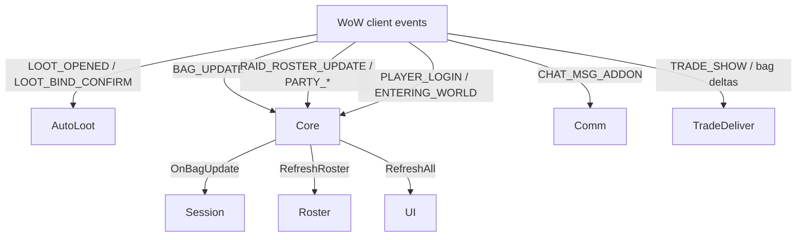
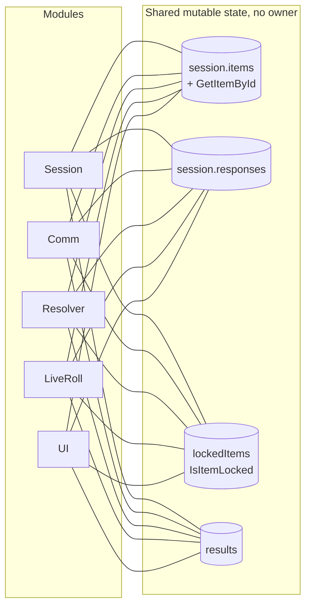
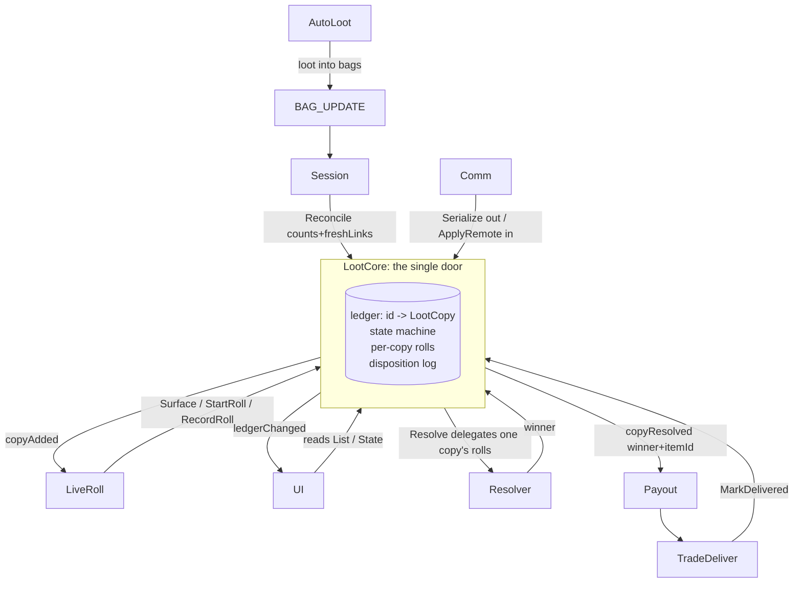

# WeirdLoot codebase flow and consolidation map

Diagram of how the addon is wired today, the coupling that causes the recurring loot
bugs, and exactly what collapses when `LootCore` lands. Line refs are evidence, not
guesses (verified 2026-06-18).

---

## 1. Event entry points

Everything is event-driven through `Core.lua`, which owns the event frame and fans out
to the modules.

`Core.lua:572` BAG_UPDATE is the single hinge: all loot enters the model only through
the bag, on purpose. AutoLoot never feeds the model directly.

---

## 2. The loot lifecycle today

```mermaid
flowchart LR
    A[AutoLoot.LOOT_OPENED\nroutes to ML bags] --> B[BAG_UPDATE]
    B --> C[Session.OnBagUpdate\nBuildTradeableEpicCounts]
    C --> D[Session.BuildSessionItemList\n-> session.items]
    D --> E[LiveRoll.AutoRollAddedItems\nShowPendingPopup]
    E --> F[StartLiveRoll\nDROP broadcast]
    F --> G[RegisterInterest\n-> session.responses]
    G --> H[ResolveLiveRoll\n-> Resolver.ResolveSessionItem]
    H --> I[results record\nWIN broadcast]
    I --> J[OwePayout / payout:Owe]
    J --> K[TradeDeliver.Engine\ndeliver + clear]
```

Parallel to the live-roll path, the **loot tab** lets the ML set responses directly
(`Session.SetPlayerResponse`) and resolve from the table. Upstream recently unified
these two response surfaces; we still carry both.

---

## 3. The coupling problem (why bugs recur)

Four mutable state blobs have **no single owner**. Each is read and written by five
modules, so any one can drift the others out of sync. This bipartite graph is the whole
problem in one picture: every crossing line is a way for state to disagree.

On top of that, **identity is done by link in two places**, which is the literal
stale-roll bug:

| Site | Code | Problem |
|------|------|---------|
| `LiveRoll.lua:872` | `it.id == roll.itemId or it.link == roll.link` | resolve can read a different copy's rolls |
| `LiveRoll.lua:674` | `HasOpenRollForLink` | "is this link rolling" instead of "is this copy rolling" |
| `LiveRoll.lua:686` | `HasOpenPendingForLink` | same, for pending popups |
| `UI.lua:973,987` | `selfRow.item.link` matching | UI row actions keyed by link |

And there are **two independent paths into the owe ledger**:

| Path | Code |
|------|------|
| table-resolve | `Resolver.lua:803` -> `OwePayout(results)` |
| live-roll | `LiveRoll.lua:834` -> `self.payout:Owe(...)` directly |

Plus a **broadcast storm**: Comm syncs state as five separate message types
(`BroadcastSession`, `BroadcastSessionLocks`, `BroadcastResults`,
`BroadcastSelectionState`, `BroadcastNamedItems`), which floods the throttle and gives
the raider mirror multiple incremental ways to drift.

---

## 4. After LootCore

`LootCore` becomes the single owner of identity, lifecycle, per-copy rolls, and
disposition. Every module reaches the loot model through one door: a query or a command,
keyed by stable copy id. Nothing keeps its own copy of loot state.

The five-way shared-state mesh in section 3 collapses to this hub-and-spoke: Session
feeds counts in, everyone else reads projections or issues commands by id, and the bag
can no longer be matched by link anywhere.

---

## 5. Consolidation opportunities

Ranked by payoff. Items 1 to 3 are the bug fixes; 4 to 6 are cleanup the core enables.

| # | Today (scattered) | Consolidates into | Kills |
|---|---|---|---|
| 1 | `session.items` + `responses` + `lockedItems` + `results`, each touched by 5 modules | one `LootCore` ledger keyed by stable id | cross-module drift, the whole class of "which copy / whose state" bugs |
| 2 | by-link lookups at `LiveRoll:674,686,872`, `UI:973,987` | id-only queries (`core:State(id)`, `core:Surfaceable()`) | stale-roll re-kill bug by construction |
| 3 | two owe paths (`Resolver:803`, `LiveRoll:834`) | one `copyResolved` event -> Payout | divergent owe accounting, double/missed owes |
| 4 | 5 Comm broadcast types for state | one `Serialize` snapshot + `ApplyRemote` | throttle flooding, incremental raider-mirror drift |
| 5 | dual response surfaces (loot-tab `SetPlayerResponse` vs live-roll `RegisterInterest`) | `core:RecordRoll(id, ...)` only | two response stores that can disagree (what upstream just patched around) |
| 6 | no disposition record anywhere | `delivered` / `removed` transitions + `core:Log()` | the missing "where did it go" audit trail |

### Stays as-is (correct boundaries, do not fold in)
- **Resolver** owns winner-picking (already correct); core only hands it one copy's rolls.
- **TradeDeliver** owns the trade engine; core only records the `MarkDelivered` result.
- **Roster / Config** own roster + rules; core stays free of them.
- **Util / ItemInfo** stay utility modules.

### The one open seam (decide before migrating, not before building)
`Resolver.ResolveSessionItem` (`Resolver.lua:525`) does not read `copy.rolls`. It calls
`BuildRollerList(item.id)` (`Resolver.lua:7`) and pulls rolls from `session.responses[id]`.
So either the core's copy `id` becomes the `responses` key, or `BuildRollerList` is
refactored to accept a rolls table. Step 1 (standalone core) does not need this answered.
